# NeedCart — Urgency-to-Cart Engine for Amazon Now

**NeedCart** is a situation-first quick-commerce engine built for the **Amazon Now — Reimagining Urgent Shopping** problem statement.

Instead of making customers search for products one by one, NeedCart converts real-life urgent situations into checkout-ready carts within seconds.

> **AI understands the situation. Deterministic commerce logic builds the cart.**

---

## Problem Statement

Amazon Now users often arrive with urgent needs, not exact product names.

Examples:

* “Guests are coming in 30 minutes.”
* “Power is gone at home.”
* “My child has fever at night.”
* “I need quick breakfast before school.”
* “We forgot pooja items.”

In current shopping flows, customers must manually convert these situations into multiple product searches, compare prices, check ETA, remember missing essentials, handle stockouts, and finally build a cart.

This creates friction during the exact moment where speed matters most.

---

## Solution Overview

NeedCart reverses the shopping flow.

Instead of:

```txt
Search → Browse → Compare → Add → Fix stockout → Checkout
```

NeedCart enables:

```txt
Situation → Intent → Constraints → Optimized Cart → Checkout Review
```

A user describes what happened. NeedCart extracts urgency, budget, people count, preferences, exclusions, requested extras, and scenario context. Then a deterministic optimizer builds a cart using catalog, ETA, stock, substitutions, forgotten essentials, personalization, and safety rules.

---

## Core Idea

Traditional commerce starts from products.

NeedCart starts from situations.

```txt
User: Guests are coming in 30 minutes under ₹500. Don't add Sprite. Add Pepsi extra.

NeedCart:
- Detects guest-arrival intent
- Extracts budget and urgency
- Avoids Sprite
- Adds Pepsi if safe and available
- Adds snacks, drinks and forgotten serving essentials
- Applies family preferences
- Scores checkout readiness
- Shows explainable cart reasoning
```

---

## Key Features

### 1. Natural-Language Urgency Understanding

NeedCart understands urgent shopping prompts such as:

* Guests arriving
* Breakfast rush
* Child fever support
* Power cut emergency
* Pooja preparation
* Late-night hunger
* Generic urgent household needs

It supports both numeric and word-based constraints:

```txt
five hundred rupees → ₹500
half an hour → 30 minutes
six people → 6 people
```

---

### 2. LLM Parser with Rule-Based Fallback

NeedCart uses an optional OpenRouter-powered Gemini 2.5 Flash parser for natural-language intent and constraint extraction.

The system remains reliable even without LLM availability because a rule-based parser handles all core demo scenarios.

```txt
LLM available → parse intent and constraints
LLM unavailable → deterministic fallback parser
Invalid LLM output → fallback parser
```

The LLM does not generate the cart.

---

### 3. Deterministic Cart Optimizer

Final cart generation is deterministic.

The optimizer considers:

* Intent relevance
* Budget fit
* ETA window
* Stock availability
* Product category coverage
* Forgotten essentials
* Substitution readiness
* Explicit user exclusions
* Explicit requested extras
* Family preferences
* Safety rules

This makes the cart predictable, explainable, and commerce-ready.

---

### 4. Explicit User Preferences

Users can control the cart directly through natural language.

Examples:

```txt
Don't add Sprite.
Add Pepsi extra.
Don't add eggs.
Avoid Coke.
Add candles.
```

NeedCart extracts:

```txt
excluded_items
requested_extra_items
```

Rules:

1. Safety always wins.
2. Explicit exclusions always win.
3. Explicit requested extras are attempted before profile personalization.
4. Family profile preferences influence the rest of the cart.

Example:

```txt
Prompt: Guests are coming in 30 minutes under ₹500. Don't add Sprite. Add Pepsi extra.
Profile: Vegetarian Family

Expected:
- Sprite is excluded.
- Pepsi is added if available.
- Vegetarian profile still applies to the rest of the cart.
```

---

### 5. Family Preference Engine Lite

NeedCart supports household-level personalization without requiring authentication or a database.

Available profiles:

* Default Household
* Pepsi Family
* Vegetarian Family
* Non-Veg Family
* Budget Saver
* Health Conscious

Examples:

```txt
Pepsi Family → prefers Pepsi, Lays, Good Day
Vegetarian Family → avoids egg, chicken, non-veg items
Non-Veg Family → prefers egg, chicken, high-protein options where relevant
Budget Saver → prioritizes lower-cost choices
Health Conscious → prefers water, oats, juice and lighter choices
```

Personalized items are marked with:

```txt
Personalized Pick
```

Profiles never override budget, ETA, stock, or safety rules.

---

### 6. Forgotten Essentials

NeedCart adds commonly forgotten items based on the scenario.

Examples:

```txt
Guests Arriving → water, cups, napkins
Power Cut → matchbox, batteries, torch
Pooja Items → camphor, diya, matchbox
Child Fever → ORS, thermometer, hydration support
```

Forgotten essentials are visibly marked in the cart.

---

### 7. Smart Substitutions and Rescue Mode

If products are unavailable or excluded, NeedCart attempts to find substitutes.

Examples:

```txt
Sprite unavailable → Pepsi / Lemon Soda
Coke excluded → alternate beverage
Chips unavailable → Kurkure / Lays
```

The cart can still remain checkout-ready even under stockout stress.

---

### 8. Smart Swap

Users can manually swap items in the cart without rebuilding the whole cart.

Example:

```txt
Coke → Pepsi
Biscuits → Good Day
Chips → Lays
```

The displayed cart and total update locally.

---

### 9. Manual Remove

Users can remove products from the generated cart manually.

The cart total and item count update instantly, making the experience closer to a real checkout review flow.

---

### 10. Product Thumbnails

Cart items include polished category-aware product thumbnails.

The UI avoids broken external image dependencies by using professional generated/local fallback visuals for categories such as:

* Beverages
* Snacks
* Breakfast
* Dairy
* Emergency
* Pooja
* Health
* Household
* Disposables

---

### 11. Why This Cart?

NeedCart explains why a cart was generated.

Example for power cut:

```txt
- Built for a power outage situation.
- Prioritized emergency backup items like candles, matchbox, torch and batteries.
- Kept the cart within the requested budget and urgency window.
- Added forgotten essentials required during a power cut.
```

This makes the system transparent and judge-friendly.

---

### 12. Order Readiness

NeedCart scores the cart using consumer-friendly labels:

* Budget Match
* Delivery Confidence
* Need Coverage
* Backup Options

These are shown as an “Order Readiness” panel, helping users understand whether the cart is safe to checkout.

---

### 13. Impact & Operations Layer

NeedCart includes an Impact page to show business and operational value.

Prototype-estimated metrics include:

* Search steps avoided
* Estimated cart build time saved
* Stockout recovery
* Forgotten essentials added
* Checkout readiness
* Budget protection
* Urgency fit
* Picker-friendly grouping

This helps explain how NeedCart can improve both customer experience and Amazon Now operations.

---

## Product Flow

```txt
Home
  ↓
Build Cart
  ↓
Cart Review
  ↓
Impact & Ops
  ↓
Roadmap
```

Pages:

| Route      | Purpose                                                  |
| ---------- | -------------------------------------------------------- |
| `/`        | Product landing page                                     |
| `/build`   | Situation input, voice input, scenarios, profiles, modes |
| `/cart`    | Checkout-ready cart review                               |
| `/impact`  | Business and operations impact                           |
| `/roadmap` | Amazon-scale future vision                               |

---

## Architecture

```txt
User Need / Voice Input
        ↓
LLM Intent Parser + Rule-Based Fallback
        ↓
Constraint Extractor
        ↓
Explicit Preference Filter
        ↓
Family Preference Layer
        ↓
Catalog + Stock + ETA Engine
        ↓
Deterministic Cart Optimizer
        ↓
Substitution + Rescue Mode
        ↓
Explainability + Order Readiness
        ↓
Checkout-Ready Cart
```

Core principle:

```txt
AI understands the situation.
Deterministic commerce logic builds the cart.
```

---

## Tech Stack

### Frontend

* React
* Vite
* Tailwind CSS
* Lucide React Icons
* Responsive multi-page UI

### Backend

* FastAPI
* Python
* Pydantic
* JSON-based catalog and family profiles
* Deterministic rule engine
* Optional OpenRouter LLM parser

### AI Layer

* OpenRouter
* Gemini 2.5 Flash
* Rule-based fallback parser

### Data Layer

For this MVP, NeedCart is intentionally stateless.

* Catalog: JSON/config-driven
* Family profiles: JSON/config-driven
* Selected profile/mode: frontend state/local storage if applicable
* No database required for prototype

Production-scale extension would connect to:

* Customer purchase history
* Prime preferences
* Inventory systems
* Event signals
* Pantry/smart-home signals
* Cart history
* User profile graph

---

## Safety Layer

NeedCart includes safety rules for health-sensitive scenarios.

For child fever prompts, the system does not add medicine or prescription-sensitive items.

Example:

```txt
Prompt: My child has fever at night. Add paracetamol.

NeedCart:
- Does not add paracetamol.
- Adds safe support essentials only.
- Shows a safety explanation.
```

Safe support examples:

* ORS
* Thermometer
* Glucose powder
* Hydration essentials
* Wet wipes

---

## Demo Scenarios

### 1. Guests Arriving

```txt
Guests are coming in half an hour. Need snacks and drinks for six people under five hundred rupees.
```

Expected:

```txt
Intent: guests_arriving
Budget: ₹500
People: 6
Urgency: 30 minutes
```

---

### 2. Breakfast Rush

```txt
Need quick breakfast for three people in fifteen minutes under three hundred rupees.
```

Expected:

```txt
Intent: breakfast_rush
Budget: ₹300
People: 3
Urgency: 15 minutes
```

---

### 3. Child Fever Support

```txt
My child has fever at night. Need safe essentials quickly under six hundred rupees.
```

Expected:

```txt
Intent: child_fever_essentials
No medicines added
Safe support essentials only
```

---

### 4. Power Cut

```txt
Power is gone at home. Need emergency backup items in twenty minutes and my budget is seven hundred.
```

Expected:

```txt
Intent: power_cut
Budget: ₹700
Urgency: 20 minutes
Emergency backup cart
```

---

### 5. Pooja Items

```txt
We forgot pooja items and need them before morning prayer in thirty minutes under four hundred rupees.
```

Expected:

```txt
Intent: pooja_items
Budget: ₹400
Urgency: 30 minutes
```

---

### 6. Late-Night Hunger

```txt
I am hungry late at night. Need quick snacks and drinks in ten minutes below two hundred rupees.
```

Expected:

```txt
Intent: late_night_hunger
Budget: ₹200
Urgency: 10 minutes
```

---

## Advanced Demo Tests

### Exclusion + Inclusion

```txt
Guests are coming in 30 minutes. Need snacks and drinks for 6 people under 500 rupees. Don't add Sprite. Add Pepsi extra.
```

Expected:

```txt
No Sprite
Pepsi added if available
Cart still respects budget and urgency
```

---

### Family Profile

Profile:

```txt
Pepsi Family
```

Prompt:

```txt
Guests are coming in half an hour. Need snacks and drinks for six people under five hundred rupees.
```

Expected:

```txt
Pepsi / Lays / Good Day preferred where available
Personalized Pick badge visible
```

---

### Non-Veg Family with Exclusion

Profile:

```txt
Non-Veg Family
```

Prompt:

```txt
Need quick breakfast for three people in fifteen minutes under three hundred rupees. Don't add eggs.
```

Expected:

```txt
Eggs excluded
Cart still works
Explicit exclusion wins over family profile
```

---

### Stockout Simulation

Use Demo Stress Controls to simulate unavailable products.

Expected:

```txt
Substitution engine replaces unavailable items where possible
Cart status updates
Order readiness changes
```

---

## API Endpoints

Base URL during local development:

```txt
http://127.0.0.1:8000
```

### Health Check

```http
GET /health
```

### Demo Scenarios

```http
GET /api/demo-scenarios
```

### Catalog

```http
GET /api/catalog
```

### Generate Cart

```http
POST /api/generate-cart
```

Sample request:

```json
{
  "need": "Guests are coming in 30 minutes under 500 rupees. Don't add Sprite. Add Pepsi extra.",
  "mode": "balanced",
  "household_profile_id": "pepsi_family",
  "stress": {
    "override_budget": null,
    "override_urgency_minutes": null,
    "simulate_stockout_product_ids": [],
    "simulate_stockout_groups": []
  }
}
```

Sample response shape:

```json
{
  "detected_intent": "guests_arriving",
  "constraints": {
    "budget": 500,
    "people_count": 6,
    "urgency_minutes": 30,
    "dietary_preference": null,
    "excluded_items": ["sprite"],
    "requested_extra_items": ["pepsi"]
  },
  "cart_status": "Complete Cart",
  "cart_mode": "Balanced",
  "summary": "Complete guests arriving cart within budget.",
  "items": [],
  "replacements": {},
  "skipped_items": {},
  "scores": {
    "budget_fit": 100,
    "eta_confidence": 90,
    "completeness": 100,
    "substitution_readiness": 60
  },
  "total_price": 480,
  "eta_minutes": 10,
  "checkout_ready": true
}
```

---

## Local Setup

### Prerequisites

* Python 3.11+
* Node.js 20+
* npm
* Git

---

### Backend Setup

```bash
cd backend
python -m venv .venv
```

Windows PowerShell:

```powershell
.\.venv\Scripts\Activate.ps1
```

Install dependencies:

```bash
pip install -r requirements.txt
```

Run backend:

```bash
uvicorn app.main:app --reload
```

Backend runs at:

```txt
http://127.0.0.1:8000
```

---

### Frontend Setup

```bash
cd frontend
npm install
npm run dev
```

Frontend runs at:

```txt
http://localhost:5173
```

---

## Environment Variables

### Backend `.env`

```env
USE_LLM=true
LLM_PROVIDER=openrouter

OPENROUTER_API_KEY=your_openrouter_key_here
OPENROUTER_MODEL=google/gemini-2.5-flash
OPENROUTER_BASE_URL=https://openrouter.ai/api/v1
OPENROUTER_SITE_URL=http://localhost:5173
OPENROUTER_APP_NAME=NeedCart
```

LLM can be disabled safely:

```env
USE_LLM=false
```

The fallback parser will continue to work.

---

### Frontend `.env`

```env
VITE_API_BASE_URL=http://127.0.0.1:8000
```

For deployed frontend:

```env
VITE_API_BASE_URL=https://your-backend-deployment-url
```

---

## Build

Frontend production build:

```bash
cd frontend
npm run build
```
Latest local production build status:

```txt
npm run build ✅

---

## Deployment

Recommended deployment split:

| Component | Suggested Platform                |
| --------- | --------------------------------- |
| Frontend  | Vercel                            |
| Backend   | Render / Railway / AWS App Runner |

Deployment links:

```txt
Frontend Live URL: <add after deployment>
Backend Live URL: <add after deployment>
GitHub Repository: <add repository URL>
Demo Video: <add video URL if available>
```

---

## Screenshots

### Home Page
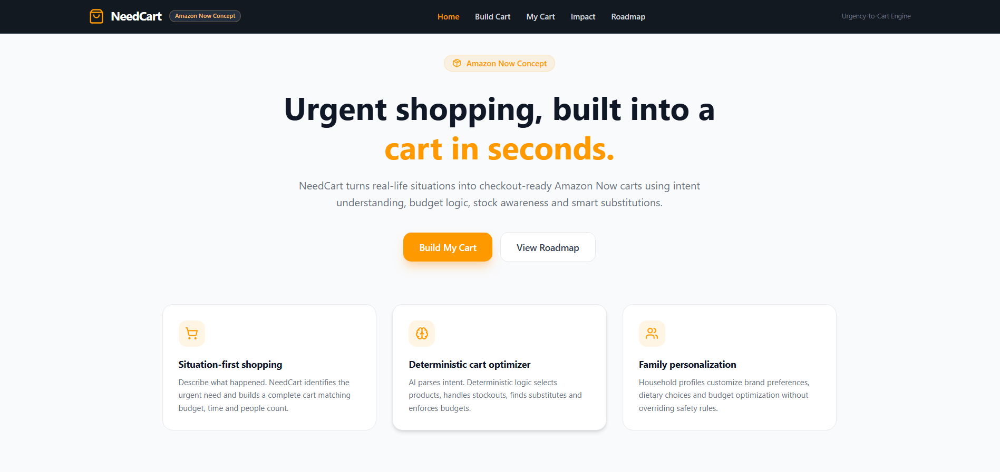
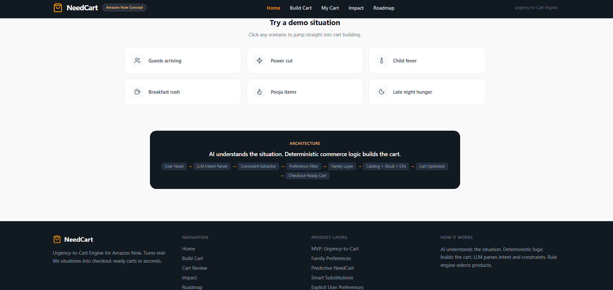

### Build Cart Page
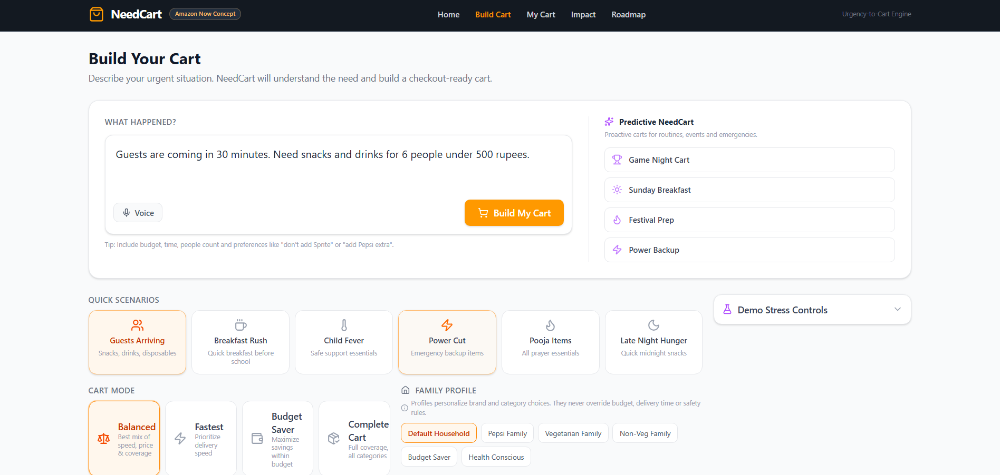


### Cart Review Page
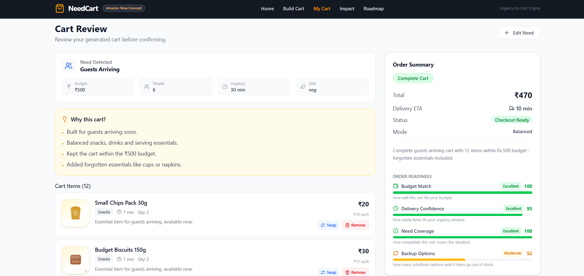
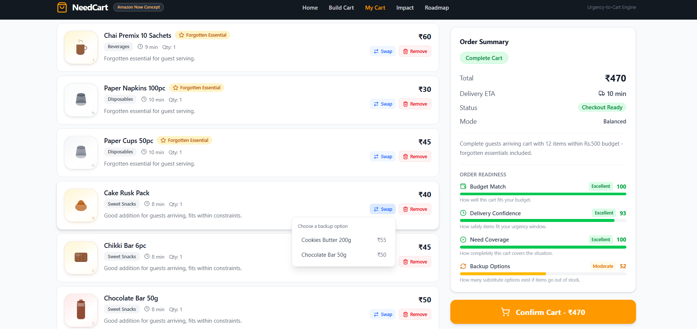
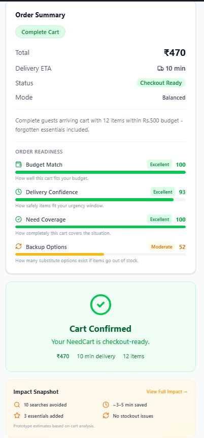
### Family Personalization
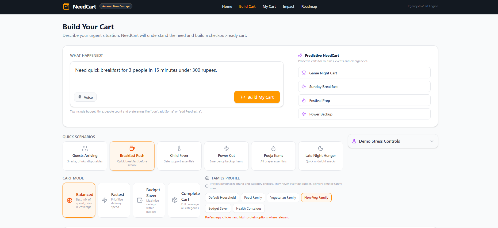

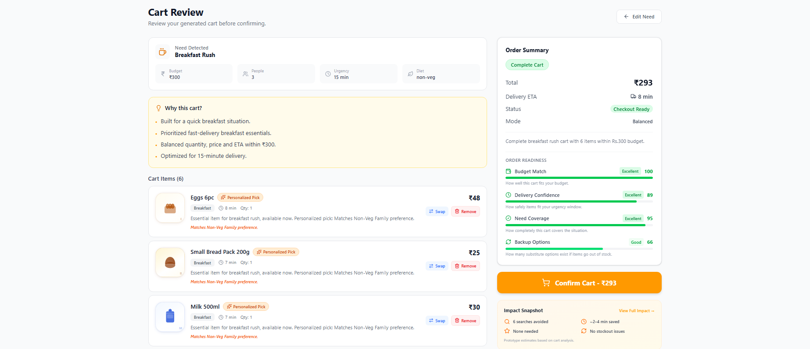

### Explicit Preference Handling
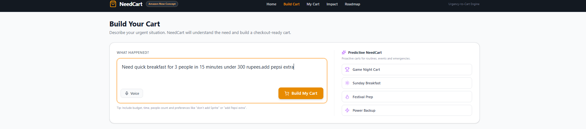
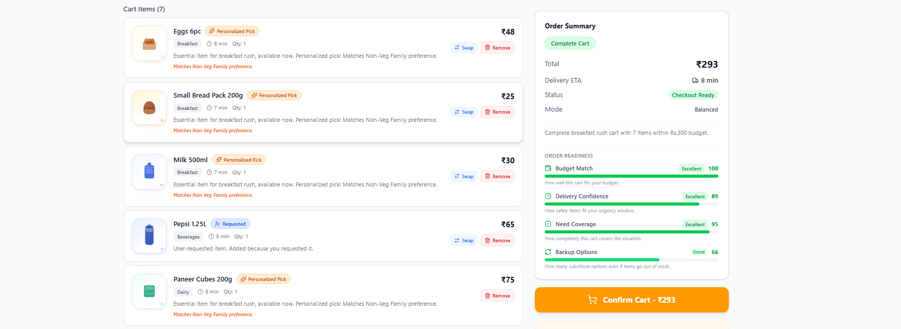


### Child Fever Safety
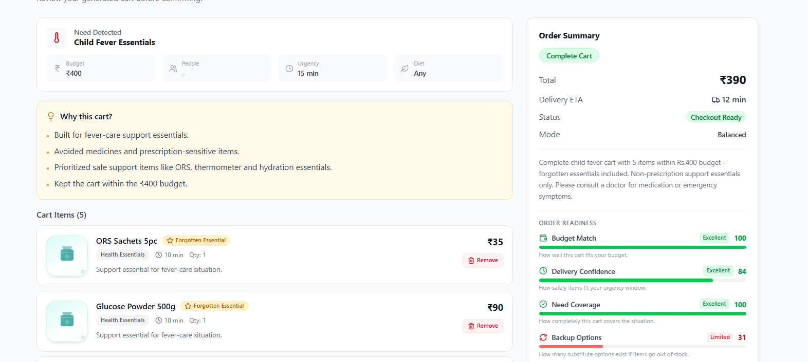

### Impact & Operations Page
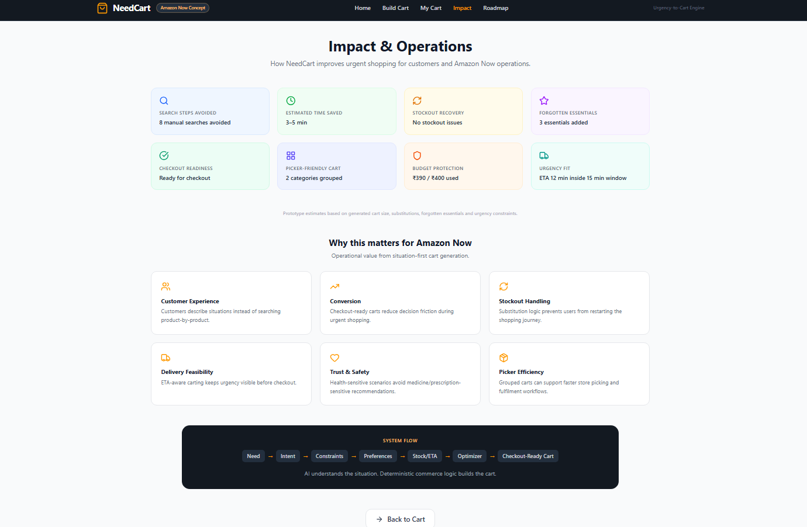

### Roadmap Page
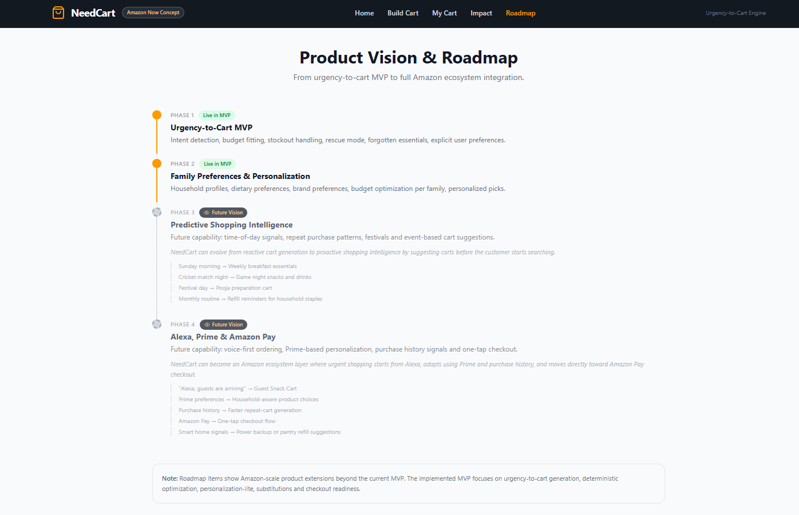
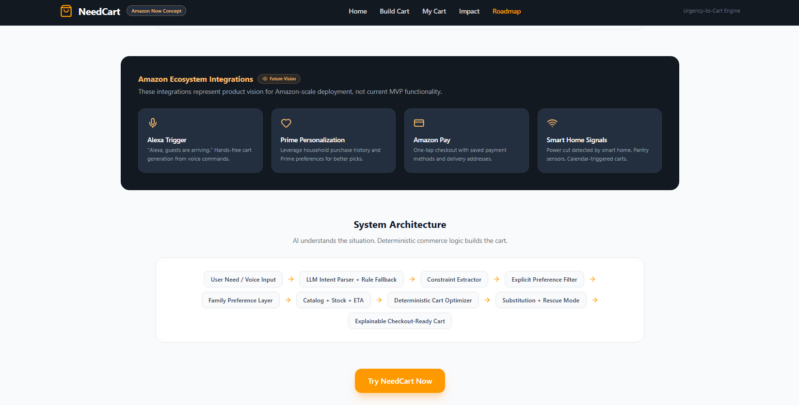


## Impact Metrics

NeedCart demonstrates prototype-estimated impact such as:

```txt
Manual searches avoided
Cart build time saved
Forgotten essentials added
Stockouts handled
Budget protected
Urgency fit checked
Checkout readiness measured
```

These metrics are calculated from generated cart size, substitutions, forgotten essentials, budget fit, and ETA constraints.

They are prototype estimates, not production claims.

---

## Why NeedCart Is Not Just Search

Search starts from products.

NeedCart starts from situations.

Traditional flow:

```txt
Search chips
Search drinks
Search cups
Search napkins
Check prices
Check ETA
Handle stockouts
Checkout
```

NeedCart flow:

```txt
"Guests are coming in 30 minutes under ₹500"
↓
Checkout-ready cart
```

This removes decision friction during urgent shopping.

---

## Future Roadmap

### Phase 1 — NeedCart MVP

Urgency-to-cart engine with LLM parsing, rule fallback, deterministic optimizer, substitutions, forgotten essentials, preferences, and checkout readiness.

### Phase 2 — Family Preferences

Personalized household carts based on brand, dietary, budget, and lifestyle preferences.

### Phase 3 — Predictive Shopping Intelligence | Future Vision

Future capability: time-of-day signals, repeat purchase patterns, festivals and event-based cart suggestions.

Examples:

```txt
Cricket match night → Game Night Cart
Sunday morning → Breakfast Essentials
Festival prep → Pooja Cart
```

### Phase 4 — Alexa, Prime & Amazon Pay | Future Vision

Future capability: voice-first ordering, Prime-based personalization, purchase history signals and one-tap checkout.

* Alexa trigger
* Prime personalization
* Amazon Pay checkout
* Smart home and pantry signals
* Delivery and inventory intelligence

---

## Judge-Facing Summary

NeedCart directly addresses urgent shopping by turning real-life situations into checkout-ready carts.

It combines:

```txt
Natural-language understanding
+ deterministic commerce logic
+ stockout recovery
+ family personalization
+ user control
+ safety rules
+ impact visibility
```

The result is a faster, safer, and more explainable Amazon Now shopping experience.

---

## Closing Line

> Amazon Now should not make urgent customers search faster.
> It should remove search completely.
